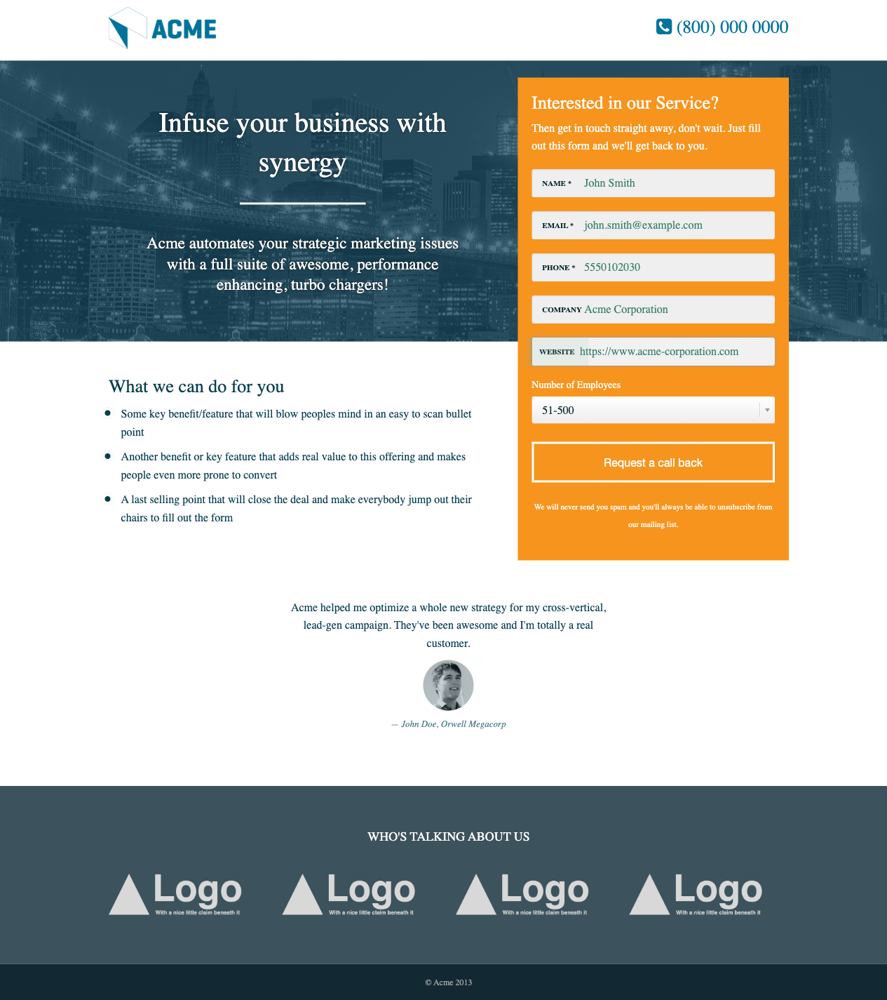

# Jones Automation Exercise

Playwright automation submission for the Jones Automation Exercise.

## Overview

This submission contains two parts:

| Part | Description |
|---|---|
| Automation | A Playwright script that fills and submits the form on `https://test.netlify.app/`. |
| QA Analysis | Written answers for the billing widget mock-up, including issues found, test cases, and a product solution. |

## Deliverables

```text
jones-automation/
  automation.js
  qa-responses.md
  screenshots/
    jones-form-before-submit.png
  package.json
  README.md
```

## Requirements

- Node.js 18 or higher
- Internet connection
- Chromium installed through Playwright

## Installation

From the `jones-automation` folder, run:

```bash
npm install
npx playwright install chromium
```

## Run

```bash
npm start
```

Or directly:

```bash
node automation.js
```

## Automation Flow

The script performs the required flow:

1. Opens Chromium.
2. Navigates to `https://test.netlify.app/`.
3. Fills the `Name`, `Email`, `Phone`, `Company`, and `Website` fields.
4. Changes `Number of Employees` from `1-10` to `51-500`.
5. Takes a screenshot before clicking `Request a call back`.
6. Clicks the `Request a call back` button.
7. Waits for the thank-you page.
8. Logs the following message:

```text
Reached thank you page
```

## Screenshot Before Submit

The screenshot is generated here:

```text
screenshots/jones-form-before-submit.png
```

It is taken before clicking the `Request a call back` button, as requested in the exercise.

<p align="center">
  
</p>

## QA Responses

The QA answers for the billing widget mock-up are written in:

```text
qa-responses.md
```

The file includes:

- Problems found in the billing UI mock-up.
- Three sample test cases.
- A product solution for the most severe visible issue.

## Notes

- The automation uses the Playwright Library with a simple Node.js script.
- The browser is launched with `headless: false`, so the Chromium window is visible while the script runs.
- The bonus requirement for `Number of Employees = 51-500` is implemented.
